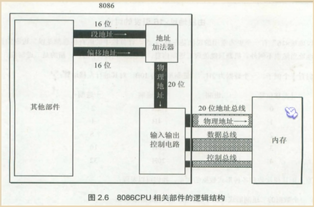
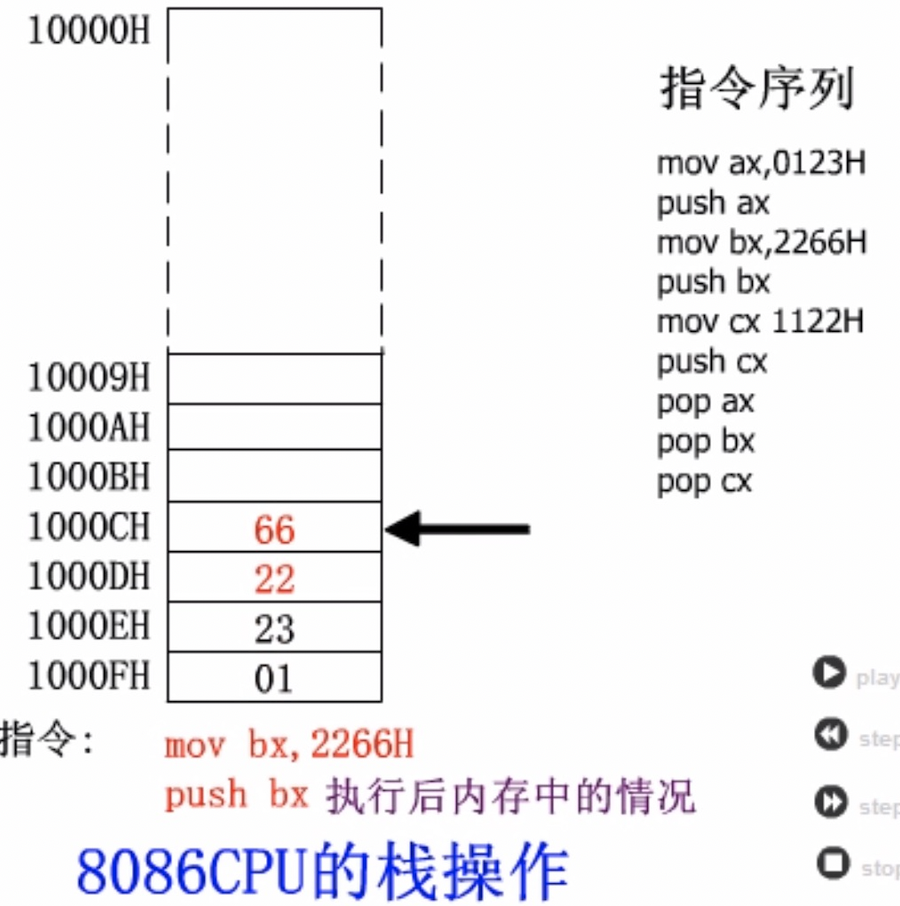
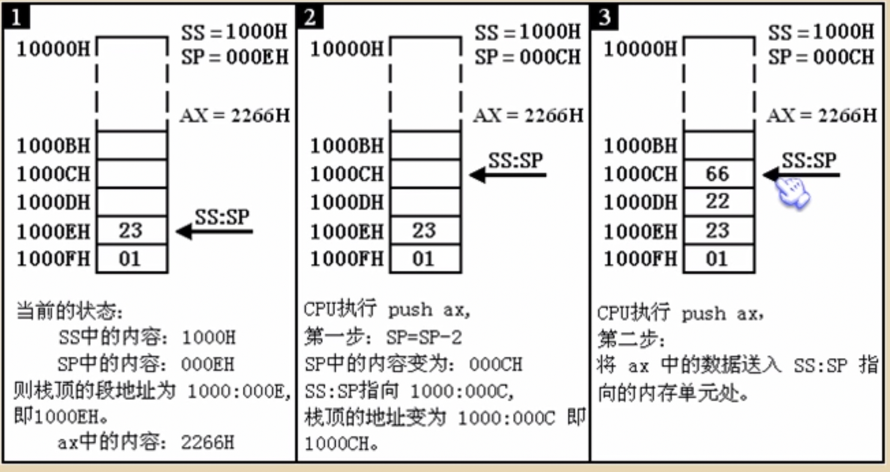
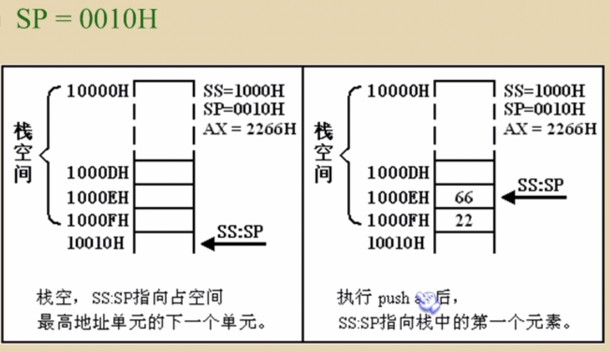
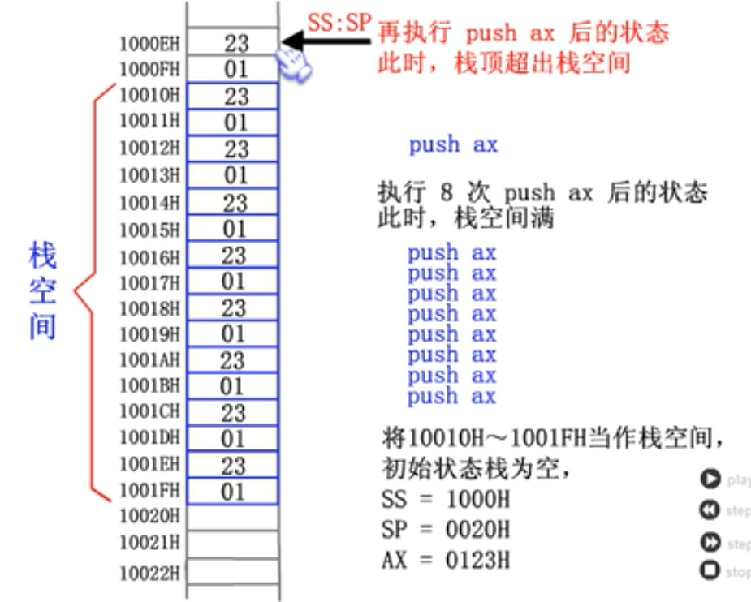

# 书推荐

编码的奥秘

# 环境准备

## DOSBox

- www.dosbox.com → Latest Version: 0.74-3 点进去 下载 → 安装
- 创建文件夹d:\asm 
- 将debug.exe link.exe masm.exe放到此文件夹
- 输入 mount c: d:\asm
- 输入 c: 
- 快速设置
  - dosbox 开启时有个黑窗口，里边有个配置文件： C:\Users\Administrator\AppData\Local\DOSBox\dosbox-0.74-3.conf
  - 在末尾 [autoexec]  后
  - 输入 mount c: d:\asm 回车
  - 输入 c:  回车
- 输入debug 就可以使用了

## winxp

- link.exe masm.exe 拷贝到xp（可加环境变量快速启动）
- 安装 sublime text 32位编辑器

# 数制转换

例如 十进制 20000
0100111000100000B
0100  1110  0010  0000B 十六进制切分
0  100  111  000  100  000B 八进制切分

# 汇编基础知识

## 字节型

1byte 内存中最小单元 如：0A是1个字节

- 1byte = 8bit    1个字节 = 2个16进制位 = 8个2进制位 （0100 0101）
- 1kb = 1024byte

## 字形

2byte 

如 连续的四个空间:

| 内存地址 |  值  | 字节型数据 | 字型数据 |        字型男数据说明         |
| :------: | :--: | :--------: | :------: | :---------------------------: |
|    0     | 20H  |    20H     |  4E20H   | 4EH是高位字节,  20H是低位字节 |
|    1     | 4EH  |    4EH     |  124EH   |                               |
|    2     | 12H  |    12H     |  0012H   |                               |
|    3     | 00H  |    00H     |    /     |                               |

## CPU

### 总线 

一根代表1bit

- 地址总线：寻址（内存）能力 一次性寻址的大小
- 数据总线：一次性传送数据的能力
- 控制总线：

## 内存空间

### 内存条 

内存中一部分地址

### 显存

内存中不同于内存条的一部分地址

### RAM ROM  

- RAM：读/写，断电数据丢失
- ROM：读，断电数据还在，一般用在启动计算机上面

### 端口

端口号 60H	

input out 指令 	就是端口的指令

### 鼠标、键盘等外设

cpu通过端口访问这些外设

端口（port  港口 装货和卸货）：读写数据

外设上有芯片，可以存储指令和数据

cpu读取外设指令的过程：

- 键盘按下A → 通过芯片传送给电脑端口
- 端口——主板三根总线——CPU
- CPU则可以通过上行方式拿到端口的指令和数据

## 指令的执行过程

- 1 CPU 从CS:IP 指向的内存读取指令,  放到  指令缓存器中
- 2 IP = IP + 所读指令长度,  从而指向下一条指令
- 3 执行指令缓存器中的内容,  回到步骤1

原因: 

# debug

## 黑色界面是内存

- 主内存（内存条）：绝大多数指令和数据的存放位置
- CPU中存放了一部分指令和数据

## 命令

- u命令   
  - 将某个内存地址开始的字节翻译成汇编指令
  - 查看机器指令 和 汇编指令
  - 0AE4:0144 750C	JNZ	0152  
    - 0AE4:0144 --内存编号
    - 705C  --机器指令
    - JNZ 0152  --汇编指令
  - u 2000:1F60
  - u 2000:0 f
- d命令
  - 将某个内存地址开始的字节全部当做数据
  - d 2000:100  --查看128个字节(FF)
  - d 2000:1 F  --查看某一段内存的内容
- r命令
  - 查看所有寄存器的值 
  - 最后一行: 将CS:IP指向的机器码翻译成汇编指令
  - 修改寄存器中的值: r 寄存器(如: r ds)
- a命令  
  - 向内存地址中写入机器码(输入汇编指令, 转换为机器码)
  - a mov ax,ffff
  - a 2000:0 mov ax,ffff
- t命令  
  - 执行CS:IP指向的机器码
- e命令
  - e 2000:0 → 1 空格 2 空格  --从2000:0位置开始 依次修改数据
  - e 2000:0 "asdf1234" --写入ascll码
- p命令
  - 完成loop循环
  - 执行int指令
- g命令
  - g 偏移地址  --如: g 14, 直接执行到14位置

## 调试流程

- 输入a 回车
- 输入命令,回车; 输入命令,回车 ; 输入命令,回车; ...
- r 查看当前命令
- 修改ss和ip寄存器, 指向第一条指令所在的内存地址
- t 单步执行输入的命令

# 寄存器

存放 地址信息 和 数据信息 的地方

## 8O86CPU

16位 可以存放两个字节 有14个寄存器  AX BX CX DX SI DI SP BP IP CS SS DS ED PSW

8086CPU架构 16位=高8位+低8位 例：AX = AH + AL

- 地址：15  14  13  12  11  10   9   8   7   6   5   4   3   2   1   0
- 值18:    0    0    0    0    0    0   0   0   0   0   0   1   0   0   1   0 
- 高8位(AH)：15 14 13 12 11 10  9  8
- 低8位(AL)：7  6  5  4  3  2  1 0

## 通用寄存器

存放数据的 数据寄存器 AX BX CX DX

**寄存器是互相独立的** 如: 执行mov al,fe; add al,99两条指令,超出al的值不会存到ah中

- AX = AH(高8位) + AL(低8位)    --用来处理数据
  - 高8位与低8位是为了兼容上一代cpu而设置
  - mov ax 0100
  - mov ah 01
  - mov ah 0100  --报错
- BX = BH + BL
- CX = CH + CL  --loop跳转次数
- DX = DH + DL  --用来处理数据

## 地址寄存器

### ~地址加法器



- 段地址 * 16 + 偏移地址 = 物理地址
  - 段地址    偏移地址   物理地址  
    2000H    1F60H       21F60H
    2100H    0F60H
    21F0H    0060H
    21F6H    0000H
    1F00H    2F60H
- 段地址 * 16 = 基础地址
- 基础地址 + 偏移地址 = 物理地址
-  0AE4:0100
  - 0AE4  --段地址
  - 0111  --偏移地址

### 段地址寄存器

- ds: 数据地址 从哪里来(习惯 可以与es反过来)
- es: 数据地址 到哪里去 
- ss: 栈顶地址
- cs: 指令地址 代码段寄存器 段地址 配合寄存器ip使用
  - jmp 段地址：偏移地址    --修改寄存器中的值
  - jmp 2AE3:3
  - jmp 3:0B16 → 0030+0B16=0B46

### 偏移地址寄存器

- sp: 栈顶地址 
- bp 
- si 
- di 
- ip: 指令指针寄存器 偏移地址
  - jmp 某一合法寄存器    --仅修改ip寄存器
  - jmp ax
  - jmp bx
  - 例子 200偏移 跳转
    - mov ax,200
    - jmx ax
- bx: 数据偏移地址

## 标志位寄存器

# 指令

不区分大小写,从后向前的顺序

## 普通指令

| 指令      | 控制CPU完成的操作            | 高级语言语法描述         |
| --------- | ---------------------------- | ------------------------ |
| mov ax,18 | 将18送入AX                   | AX = 18                  |
| mov ah,78 | 将78送入AH                   | AH = 78                  |
| add ax,8  | 将寄存器AX中的数值加8        | AX = AX + 8              |
| mov ax,bx | 将寄存器BX中数据送入寄存器AX | AX = BX                  |
| add ax,bx | 将AX BX中内容相加,结果存入AX | AX = AX + BX             |
| inc bx    | 将BX中的值+1,                | BX++  比add bx,1节约内存 |

```assembly
mov 寄存器,数据     mov ax,6
mov 寄存器,寄存器   mov bx,ax
mov 寄存器,内存单元 mov ax,[0]
mov 内存单元,数据   mov [0],ax
mov 段寄存器,寄存器 mov ds,ax
mov 寄存器,段寄存器 mov ax,ds

add 寄存器,数据     add ax,8
add 寄存器,寄存器   add ax,bx
add 寄存器,内存单元 add ax,[0]
add 内存单元,寄存器 add [0],ax

sub 寄存器,数据    sub ax,9
sub 寄存器,寄存器  sub ax,bx
sub 寄存器,内存单元 sub ax,[0]
sub 内存单元,寄存器 sub [0],ax
```

## 除法指令 div

| 参数   | 除数8位              | 除数16位                    |
| ------ | -------------------- | --------------------------- |
| 被除数 | 16位, ax             | 32位, dx存高16位 ax存低16位 |
| 除数   | 8位寄存器 / byte ptr | 16位寄存器 / word ptr       |
| 商     | al                   | ax                          |
| 余数   | ah                   | dx                          |

```assembly
db 3,0,0,0

mov ax 16
; 第一种
mov bl 3
div bl
; 第二种
div byte ptr ds:[0]
```


## 转移指令

- jmp
  - jmp 2000:0  --CS=2000  IP=0000    --修改CS:IP的值
  - jmp 寄存器    --仅修改IP
  - 跳转原理
  
  ```assembly
  ; 第一种情况
  	; 汇编码
          jmp s
          mov ax,1000
          mov ax,10
          mov al,1
      s:	mov ax,1000H
          mov ax,100H
  	; debug显示编译结果
      0B3D:0000 EB09		JMP		000B
      0B3D:0002 90		NOP	
      0B3D:0003 B8E803	MOV		AX,03E8
      0B3D:0006 B80A00	MOV		AX,000A
      0B3D:0009 B001		MOV		AL,01
      0B3D:000B B80010	MOV		AX,1000		;s标号
      0B3D:000E B80001	MOV		AX,0100
      
  ; 第二种情况
      ; 汇编码
          jmp s
          mov ax,1000
          mov al,1
      s:	mov ax,1000H
          mov ax,100H
      ; debug显示编译结果
      0B3D:0000 EB06		JMP		000B
      0B3D:0002 90		NOP	
      0B3D:0003 B8E803	MOV		AX,03E8
      0B3D:0006 B064		MOV		AL,64
      0B3D:0008 B80010	MOV		AX,1000		;s标号
      0B3D:000B B80001	MOV		AX,0100
      
  ; 由上述可看出 jmp编译后的机器码的第二字节=要跳过的指令长度
  ; CPU执行jmp指令时, 并不需要跳转目的地址, 就可对IP寄存器修改
  ; jmp机器码第二字节 = 标号地址 - jmp指令后一个字节地址(指令缓冲器)
  
  ; 第三种情况
  	; 汇编码
  	s:	mov ax,1000H
  		jmp s
  		mov ax,4C00H
  		int 21H
  	; debug显示编译结果
  	0B3D:0000 B80010	MOV		AX,1000		;s标号
  	0B3D:0003 EBFB		JMP		0000
  	0B3D:0005 B8004C	MOV		AX,4C00
      0B3D:0008 CD21		INT		21
  ; 此处 jmp机器码第二字节为FB
  ; 按照上边公式 5 + FB(-5) = 0
  ; 计算机中负数采用补码形式:正数变二进制,然后按位取反 再+1
  ```
  
  - 跳转范围  --位移范围
    - 8位位移 8个二进制 -128~127
    - 16位位移 -32768~32767
    - 指定位移方式
      - jmp short s  --8位位移
      - jmp near ptr s
  
- call     如:call 001c
  
  - 跳转到001c对应位置指令,  并将本该执行的下一条指令对应的IP保存
  
- ret
  - 将call指令保存的IP拿过来,并执行
  - call ret结合类似于高级语言的方法调用
  
- loop

  - 配合cx寄存器使用
  - 先cx-- 再判断 如果cx==0 则结束循环 继续向下执行
  - p命令 执行 直接完成loop循环
  - g 14 命令: 直接执行到14位置的指令

## 条件转移指令

所有都是短转移 范围为-128~127

经过编译后 机器码中包含位移范围 如jmp→EBXX

- jcxz
  - jmp cx zero 
  - 当cx=0时 跳转

## 栈指令 PUSH POP

可以在寄存器和内存之间传送数据

- PUSH 段寄存器 
- POP 段寄存器
- PUSH 内存单元
  - PUSH [0]  
  - push ds:[0]
  - push ds:[bx]
  - 找到DS段地址和[0]偏移地址数据推进栈
- POP 内存单元
  - POP [2]

## 逻辑运算指令

按照二进制位运算

- and --同1为1
  - and al,11110000B
- or  --有1为1
  - or al,01010101B

## 伪指令

- dup 重复

```assembly
db 	100 dup (0) ; 重复100个字节 都为0
```

## 操作符

- offset  --取得标号处的偏移地址

```assembly
	mov ax,offset s
s:	mov ax,offset s
```


## CUP如何区分指令和数据

CS:IP 指向指令

## CPU与内存交互

### CPU ← 内存

- mov al,ds:[0]    --字节的传送
- mov ax,ds:[0]   --字的传送
  - [0] 偏移地址
  - debug中应写作: mov al,[0]

### CPU → 内存

- mov ds:[0],ax
- mov ds:[0],al
  - [0] 偏移地址
  - debug中应写作: mov [0],al

### 例如: 读取10000H单元的内容

```
mov bx,10000H   ds段寄存器不能直接赋值，需要通过通用寄存器
mov ds,bx
mov al,[0]      内存送入寄存器, (mov 寄存器名，内存单元地址) 
        [...]偏移地址, 段地址默认放在DS中
        []说明操作对象是一个内存单元
        [0]说明这个内存单元的偏移地址是0
mov [0],al      寄存器送入内存
流程： 数据 → 通用寄存器 → 段寄存器
```

### 例如: 累加前三个单元

将123B0H~123BAH的内存单元定义为数据段,累加前三个单元,代码如下:

```
mov ax,123BH
mov ds,ax       将123BH送入ds中,作为数据段的段地址
mov al,0        用al存放累加结果
add al,[0]      将数据段第一个单元(偏移地址为0)中的数值加到al中
    mov al,[0] = mov al,0 + mov al,[0]
add al,[1]      将数据段第二个单元(偏移地址为0)中的数值加到al中
add al,[2]      将数据段第三个单元(偏移地址为0)中的数值加到al中
```

# 栈

是一段连续的内存单元 也就是一段连续的内存地址

特殊的访问形式上   		区别mov指令

## 先进后出 

PUSH(入栈)  POP(出栈)  只操作字型数据


 

- SS:SP指向栈顶元素 栈顶标记 黑色箭头位置
  - 段寄存器SS  存放<b>栈顶</b>的段地址
  - 寄存器SP      存放<b>栈顶</b>的偏移地址

## push ax

- 1: SP=SP-2
- 2: 将ax中内容送入SS:SP指向的内存单元处,SS:SP指向新栈顶
  
- 当栈为空时,SP偏移地址指向下一个内存地址
  

## pop bx

- 1: sp = sp + 2
- 

## 栈顶超界问题

溢出的内存为未知程序使用的内存,会很危险

- PUSH溢出
  
- POP溢出
  

## 栈的大小

- 最大65536个字节
  - ss=2000 sp=0~FFFFH=0~65535byte
- push 1234H, 若之前sp=0000H,则之后sp=FFFEH

## 作用

- 临时性保存数据 

  - call指令和ret指令


  ```assembly
  mov ax,100
  call func		;
  mov bx,ax
  func:
  	push ax
  	push bx		;栈中临时保存
  	mov bx,1000
  	mov ax,100
  	add cx,bx
  	pop bx
  	pop ax		;从栈中取出 这样3行执行时寄存器值就不会变化
  	ret
  ```

- 数据交换

  ```assembly
  push ax		;寄存器
  push bx
  pop ax
  pop bx
  push ds:[0]	;内存
  push ds:[2]
  pop ds:[0]
  pop ds:[2]
  ```

- 实质就是mov指令 只不过是ss:sp操作

## 指令

- 例如: 栈空间10000H~1000FH(ss=1000,偏移地址指向最下边地址+2), 将ax bx ds 数据入栈

```
mov ax,1000H  段地址
mov ss,ax     设置栈的段地址,ss=1000H,数据不能直接送入段寄存器,用ax中转
mov sp,0010H  设置栈顶的偏移地址,因为栈为空,则需+2
    上面三条指令设置栈顶地址,注意栈的大小
push ax
push bx
push ds
```

# 编译 链接 分配内存

## 编译

masm *.asm   →   *.obj

## 链接

link *.obj  →   *.exe

## 系统分配内存

exe文件中, 除了程序, 还包括一些**描述信息**, 如文件有多大,程序在哪里等. 系统就是根据这些描述信息对寄存器进行相关的设置.

start伪指令, 就是设置的程序的入口, 记录在描述信息中

exe可执行文件 不只包括了整个程序 还包括了描述信息

# 汇编代码

## 源文件

- 汇编指令	被编译器翻译成 0101100101010101... 机器指令 机器码 由CPU执行
- 伪指令 	   由编译器执行的
- 符号体系	由编译器执行的

```assembly
;assume假设 cs寄存器和code段联系在了一起
assume cs:code,ds:data,ss:stack 	;CPU对寄存器设置的依据

;段名字可以随意取
;这里写data为了方便阅读
data segment 	;告诉编译器 data段从这里开始 
	db		128	dup	(0)
data ends		;告诉编译器 data段从这里结束

statck segment stack 	;第二个stack告诉编译器这是栈段,第一个statck只是标记名,可以修改
	db		128 dup (0)
statck ends

code segment
	start:	mov bx,0100H 	;start 是标记程序开始执行的地方 将程序入口地址 记录在exe文件的描述信息中
							;或者不加start  将code段转移到3行位置
								
			mov cx,0b800H 	;字母在前方必须加0 一种翻译的规则
			mov ax,160*5-12*5 	;符号体系 由编译器计算出来
			
			mov ax,4c00H 	;这两行 程序返回的功能
			int 21h 		;执行完后 将内存和寄存器 都还给系统
code ends

end 	;告诉编译器整个程序到这里结束啦
```

## 程序的跟踪

- debug *.exe
- r命令 
  - cx = 程序的长度
- t命令  单步执行
- p命令  执行int指令
- q命令  p命令后执行 退出程序

## PSP区

从ds:0开始的 256个字节

用来 系统和程序之间 进行通信的

## 更灵活的定位内存地址

见 code/test05_RAM.asm

## 以字符形式给出数据

- ASCLL码
  - 为什么 a为97 A为65?   
    - 看65 97二进制  使用and or 指令  进行大小写转换
    - 大写 and 11011111B
    - 小写 or 00100000B
  - 0~31为控制字符 不能被打印
  - 32~127位打印字符

```assembly
data segment
		db 		'123456adf adhgh !lkj l' ; 单引号
date ends
```

## 实验

Test.asm

```assembly
assume cs:code

code segment
			mov ax,2000H
			mov ss,ax
			mov sp,0
			add sp,10H
			pop ax
			pop bx
			push ax
			push bx
			pop ax
			pop bx

			mov ax,4c00H
			int 21h
code ends

end
```

- masm test.asm

- link TEST.OBJ

  - 前2行可使用脚本 compile.bat

  ```
  del TEST.EXE;
  masm test.asm;
  link TEST.OBJ;
  del TEST.OBJ;
  start cmd /k
  ```

- debug TEST.EXE

- u命令 查看指令

- r命令 查看

- e 2000:10  → 22 11 44 33    设置值

- t命令单步执行

- p命令 执行int指令

- q命令 退出

# 进度

https://www.bilibili.com/video/BV1mt411R7Xv?p=137&spm_id_from=pageDriver


