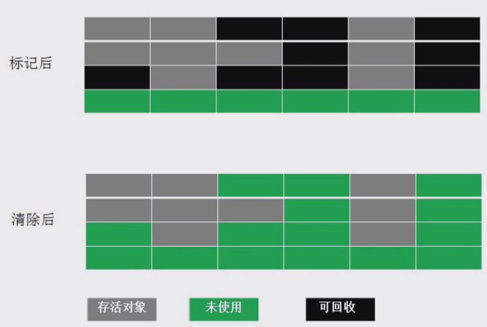
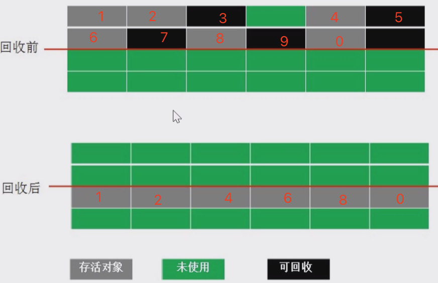
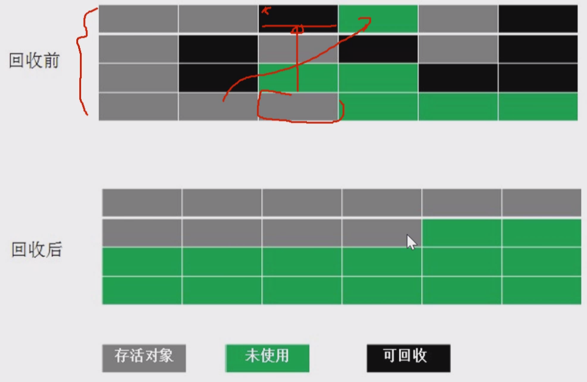
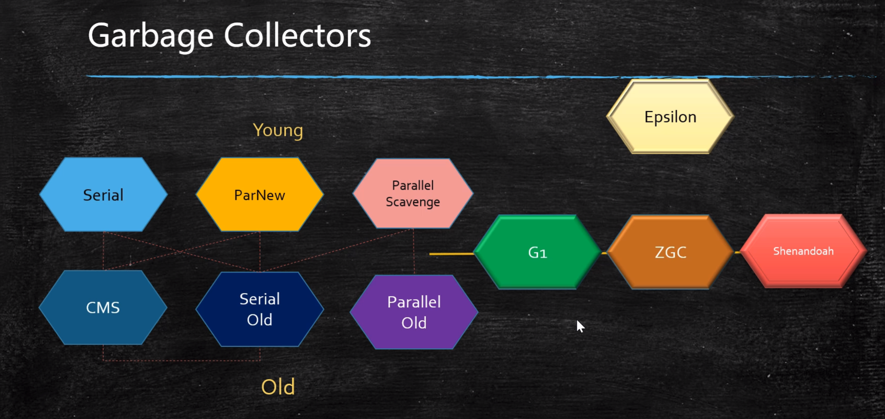
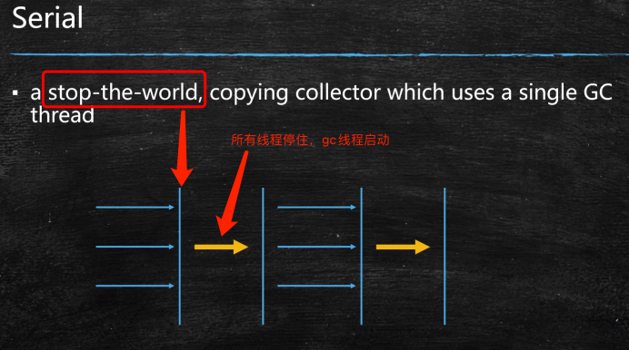
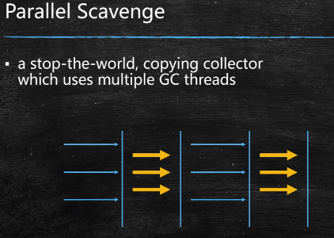
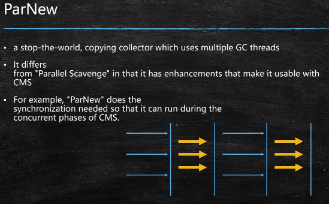
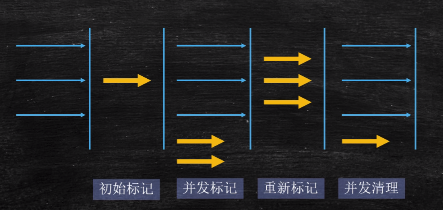

# 基础

## 什么是垃圾

- C：malloc free
- C++：new delete
- java：new ？
  - 自动内存回收，容易出现两种问题：忘记回收、多次回收

没有任何引用指向的一个对象或者多个对象（循环引用），那么它就是垃圾

循环引用：A -> B -> C -> A 

## 如何确定垃圾

1. 引用计数：reference count，不能解决循环引用问题
2. 根可达算法（根搜索算法）
   - 根对象：GC roots，这些不是垃圾
     - JVM stack：线程栈变量
     - native method stack：本地方法栈，JNI指针
     - run-time constant pool：常量池
     - static references in method area：静态变量
     - Clazz

## 常见的垃圾回收算法

1. 标记清除：Mark-Sweep，位置不连续，产生碎片

   

2. 拷贝算法：没有碎片，浪费空间

   

3. 标记压缩：没有碎片，效率偏低(任何一块挪动，都需要线程同步)

   

## JVM内存分代模型

用于分代垃圾回收算法，部分垃圾回收器使用的模型

1. 新生代 + 老年代 +   永久代(1.7)/元数据区(1.8 Metaspace)
   1. 永久代/元数据： Class对象
   2. 永久代必须指定大小限制 ，元数据可以设置，也可以不设置，无上限（受限于物理内存）
   3. 字符串常量：1.7-永久代，1.8-堆
   4. MethodArea：方法区，逻辑概念，永久代/元数据
   5. 永久代、元数据区不归堆管
2. 新生代 = Eden(80%) + 2个suvivor区(暂叫s0:10% s1:10%)，copy算法
   1. YGC回收之后，大多数的对象会被回收，活着的进入s0
   2. 再次YGC，活着的对象eden + s0 -> s1
   3. 再次YGC，eden + s1 -> s0
   4. 实际就是两个s区来回倒
   5. 年龄足够 -> 老年代 （老的回收器:15次 CMS:6次）
   6. suvivor区装不下 -> 老年代
3. 老年代
   1. 顽固分子
   2. 老年代满了FGC(Full GC)，是整个内存FGC
4. GC Tuning (Generation), 调谐
   1. 尽量减少FGC
   2. MinorGC = YGC
   3. MajorGC = FGC

## 常见的垃圾回收器



1. Serial 年轻代 串行回收

   

2. PS 年轻代 并行回收

   

3. ParNew 年轻代 配合CMS的并行回收

   

4. SerialOld 

5. ParallelOld 

6. CMS：ConcurrentMarkSweep 老年代 并发的， 垃圾回收和应用程序同时运行，降低STW的时间(200ms)

   

7. G1(10ms)

8. ZGC (1ms) PK C++

9. Shenandoah

10. Eplison 调式JVM使用

调优就是调1、2、4、5。因为 1.8默认的垃圾回收：PS + ParallelOld

## JVM调优第一步，了解生产环境下的垃圾回收器组合

* JVM的命令行参数参考：https://docs.oracle.com/javase/8/docs/technotes/tools/unix/java.html

* JVM参数分类

  > 标准： - 开头，所有的HotSpot都支持
  >
  > 非标准：-X 开头，特定版本HotSpot支持特定命令
  >
  > 不稳定：-XX 开头，下个版本可能取消

  -XX:+PrintCommandLineFlags：启动java程序的命令行参数

  -XX:+PrintFlagsFinal 最终参数值

  -XX:+PrintFlagsInitial 默认参数值 

  ```sh
  例如
  java -XX:+PrintCommandLineFlags
  ```

  

## 参考资料

1. https://blogs.oracle.com/jonthecollector/our-collectors
2. https://docs.oracle.com/javase/8/docs/technotes/tools/unix/java.html
3. http://java.sun.com/javase/technologies/hotspot/vmoptions.jsp

# JVM


JIT：代码用到的特别多，会被JIT即时编译，下一次运行就不会再次经过解释器了

任何语言 --编译成--> .class规范 -> JVM执行

JVM 规范：https://docs.oracle.com/javase/specs/index.html

## 虚构出来的一台计算机

- 字节码指令集（汇编语言）
- 内存管理：栈 堆 方法区等

## 常见JVM实现

- Hotspot
  - oracle官方，我们做实验用的JVM
  - java -version
  - Jvm8 以后要收费
- Jrockit
  - BEA，曾经号称世界上最快的JVM
  - 被oracle收购，合并于Hotspot
- J9-IBM
- Microsoft VM
- Taobao VM
  - hotspot深度定制版
- LiquidVM
  - 直接针对硬件
- azul zing
  - 收费 贵
  - 最新垃圾回收的业界标杆 1ms
  - www.azul.com

## JVM JRE JDK

jvm 虚拟机

jre = jvm + core lib

jdk = jre + development kit

# Class 结构


# 类加载-初始化

## class loading

1. 双亲委派
   - 打破双亲委派
     - 重写loadClass（）
   - 打破双亲委派情况
     - JDK1.2之前，自定义ClassLoader都必须重写loadClass()
     - ThreadContextClassLoader可以实现基础类调用实现类代码，通过thread.setContextClassLoader指定
     - 热启动，热部署
       - osgi tomcat 都有自己的模块指定classloader（可以加载同一类库的不同版本）
2. LazyLoading 5种情况
   - new getstatic putstatic invokestatic指令，访问final变量除外
   - java.lang.reflect对类进行反射调用时
   - 初始化子类的时候，父类首先初始化
   - 虚拟机启动时，被执行的主类必须初始化
   - 动态语言支持java.lang.invoke.MethodHandle解析的结果为REF_getstatic REF_putstatic REF_invokestatic的方法句柄时，该类必须初始化
3. ClassLoader的源码
   - findInCache -> parent.loadClass -> findClass()
4. 自定义类加载器
   1. extends ClassLoader
   2. overwrite findClass() -> defineClass(byte[] -> Class clazz)
   3. 加密

## Linking

1. Verification：验证文件是否符合jvm规定

2. Preparation：静态成员变量赋默认值

   ```java
   psvm{
       sout(T1.count); // 3
       sout(T2.count); // 2
   }
   class T1{
       public static int count = 2;
       public static T1 t = new T1();  
       private T1() { count++; }
   }
   class T2{
       public static T2 t = new T2();  // static 换顺序
       public static int count = 2;
       private T2() { count++; }
   }
   ```

   

3. Resolution：解析，将类、方法、属性等符号引用解析为直接引用

   - ClassLoader.loadClass 第二个boolean参数
   - 符号引用：常量池中类的名字，L-java.lang.Object(符号指向这个字符串)，将这个符号指向内存地址
   - 常量池中的各种符号引用解析为指针、偏移量等内存地址的直接引用

## 小结

new 对象：先申请内存，再赋默认值，再赋初始值

## jvm执行模式

hot spot = 热点  ？

- 解释器
  - bytecode intepreter
  - jvm参数
    - -Xint 解释模式，启动快，执行稍慢
- JIT
  - jv参数
    - -Xcomp 纯编译模式，启动很慢，执行很快
  - just in time compiler
  - 将热代码保存为本地代码(exe文件)
  - 效率高于解释器模式
- 混合模式 
  - jvm参数
    - -Xmixed 默认混合
    - 开始解释执行，启动速度较快
    - 对热点代码实行检测和编译
  - 解释器+热点代码编译
  - 起始阶段采用解释执行
  - 热点代码检测 -XX:Compile hreshold = 10000
    - 多次被调用的方法（方法计数器：检测方法执行频率）
    - 多次被调用的循环（循环计数器：检测循环执行频率）
    - 进行编译


老的CPU总线锁

新的CPU各种一致性协议 MESI协议(inter CPU 缓存一致性协议)

现代cpu的数据一致性实现 = 缓存锁(MESI ...) + 总线锁

缓存行：cache line 缓存最小单位，多数为64字节


# 进度

第一节 00:50:00

 第三节（93）  02:00:00

