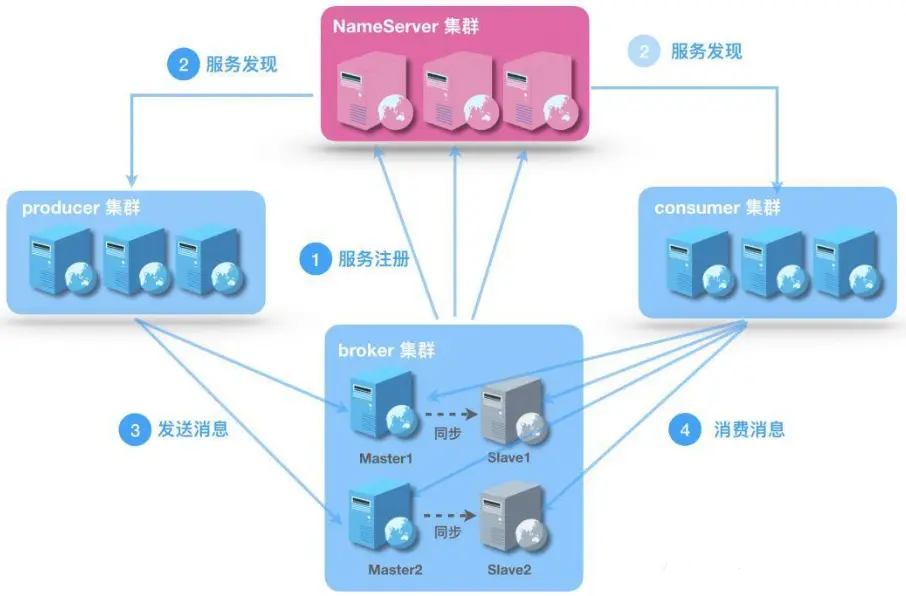

# 安装 启动

## 安装

1. github 下载源码
2.  源码根目录执行： mvn -Prelease-all -DskipTests clean install -U
3. cd distribution/target/rocketmq-4.6.1/*/ ，即发布版
4. 将程序包移动到合适位置

## 启动

1. ./bin/mqnamesrv 前台启动nameserver
   1. vi runserver.sh，-Xms4g -Xmx4g -Xmn2g
2. ./bin/mqbroker -n localhost:9876 前台启动broker
   1. -n ip:port  --指定nameserver
   2. No address associated with hostname
      1. 添加hosts 配置
   3. vi runbroker.sh ，修改 -Xms512M -Xmx512m -Xmn=128M

## 测试用例

1. ./bin/tools.sh org.apache.rocketmq.example.quickstart.Producer
2. 报错
   1. connect to null failed：
      1. tools.sh 添加 export NAMESRV_ADDR=localhost:9876
      2. 注意不是加到最后 应该是指定位置
   2. broker 启动需要指定nameserver

## console

1. 下载
   1. git clone https://github.com/apache/rocketmq-externals.git
2. 安装
   1. cd rocketmq-console
   2. mvn clean package -Dmaven.test.skip=true
   3. mv ./target rocketmq-console-ng-1.0.1.jar /***
3. 启动
   1. java -jar rocketmq-console-ng-1.0.1.jar


## 其他扩展

https://github.com/apache/rocketmq-externals

# 角色



## nameServer

底层由netty实现，提供了路由管理、服务注册、服务发现的功能，是一个无状态节点，保证高可用，不保证一致性

- **nameserver是服务发现者**，集群中各个角色（producer、broker、consumer等）都需要定时向nameserver上报自己的状态，以便互相发现彼此。超时不上报，nameserver会把它从列表中剔除
- **nameserver可以部署多个**，当多个nameserver存在的时候，其他角色同时向他们上报信息，以保证高可用，
- **NameServer集群间互不通信**，没有主备的概念
- **nameserver内存式存储**，nameserver中的broker、topic等信息默认不会持久化

## broker

- Broker面向producer和consumer接受和发送消息
- 向nameserver提交自己的信息
- 是消息中间件的消息存储、转发服务器。
- 每个Broker节点，在启动时，都会遍历NameServer列表，与每个NameServer建立长连接，注册自己的信息，之后定时上报。

**broker集群**

- Broker高可用，可以配成Master/Slave结构，Master可写可读，Slave只可以读，Master将写入的数据同步给Slave。
  - Master与Slave的对应关系通过指定相同的BrokerName，不同的BrokerId来定义BrokerId为0表示Master，非0表示Slave
- Master多机负载，可以部署多个broker
  - 每个Broker与nameserver集群中的所有节点建立长连接，定时注册Topic信息到所有nameserver。

## producer

- 消息的生产者
- 通过nameserver集群中的其中一个节点（随机选择）建立长连接，获得Topic的路由信息，包括Topic下面有哪些Queue，这些Queue分布在哪些Broker上等
- 接下来向提供Topic服务的Master建立长连接，且定时向Master发送心跳

## consumer

消息的消费者，通过NameServer集群获得Topic的路由信息，连接到对应的Broker上消费消息。

注意，由于Master和Slave都可以读取消息，因此Consumer会与Master和Slave都建立连接。

## 关于 topic

Topic是一个逻辑上的概念，实际上Message是在每个Broker上以Queue的形式记录。


# 使用

## producer

```java
DefaultMQProducer producer = new DefaultMQProducer("xoxogp");
// 设置nameserver地址
producer.setNamesrvAddr("192.168.150.113:9876");
producer.start();
```

**同步消息**

```java


Message msg1 = new Message("myTopic001", "xxxxooo 1".getBytes());
Message msg2 = new Message("myTopic001", "xxxxooo 2".getBytes());
Message msg3 = new Message("myTopic001", "xxxxooo 3".getBytes());

ArrayList<Message> list = new ArrayList<Message>();
list.add(msg1);
list.add(msg2);
list.add(msg3);

// 同步消息发送 批量
SendResult sendResult3 = producer.send(list);

producer.shutdown();
```

**异步消息**

```java
Message msg0 = new Message("myTopic001", "xxxxooo 0".getBytes());
// 异步可靠消息
// 不会阻塞，等待broker确认
// 时间监听方式接收broker返回的确认
producer.send(msg0, new SendCallback() {
    public void onSuccess(SendResult sendResult) {
        // TODO Auto-generated method stub
        System.out.println("ÏûÏ¢·¢Ëͳɹ¦¡£¡£¡£");
        System.out.println("sendResult £º" + sendResult);
    }
    public void onException(Throwable e) {
        // 若异常 通过case异常，常识重投
        // 或调整业务逻辑
        e.printStackTrace();
        System.out.println("·¢ËÍÒì³£");
    }
});

// 异步消息不能随便关闭
// producer.shutdown();

// or =============== 
// 单向消息 只发一次 不会等待确认 数据敏感不可用
// p 网络不确定性 容易丢消息
producer.sendOneway(message);
```


## consumer

```java
DefaultMQPushConsumer consumer = new DefaultMQPushConsumer("xxoocsm");		
consumer.setNamesrvAddr("192.168.150.113:9876");

/**
		 * a()
		 * c()
		 * d()
		 * b -> Ïò rocketmq дÈëÒ»ÌõÏûÏ¢()
		 * rollback()
		 * 
		 * 
		 * 
		 */

// ÿ¸öconsumer ¹Ø×¢Ò»¸ötopic

// topic 关注的消息主题
// 过滤器 * 表示不过滤
consumer.subscribe("myTopic002", "*");
consumer.registerMessageListener(new MessageListenerConcurrently() {
    public ConsumeConcurrentlyStatus consumeMessage(List<MessageExt> msgs, 
                                                    ConsumeConcurrentlyContext ctx) {
        for (MessageExt msg : msgs) {
            System.out.println(new String(msg.getBody()));;
        }
        // 默认 这条消息只会被一个consumer消费到 点对点
        // message 状态修改
        // ack 接收确认
        return ConsumeConcurrentlyStatus.CONSUME_SUCCESS;
    }
});
// 集群（默认），一组consumer 
// 广播，消息发送给所有 订阅了此主题的consumer
consumer.setMessageModel(MessageModel.CLUSTERING);
consumer.start();

// ¼¯Èº -> Ò»×éconsumer
// ¹ã²¥
```


# 进度

第二节 1:29:00 消费模式